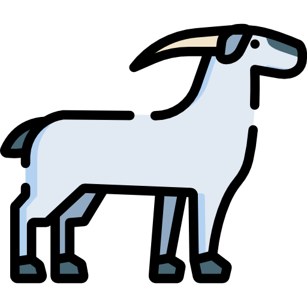

<!-- PROJECT LOGO -->
 

  

  <h1>Caprezzo Digitale</h1>

  

    Servizio .Net Core - PWA dedicato a una più corretta ed efficacia comunicazione con il cittadino.
     
     
    <a href="https://drive.google.com/drive/folders/180SqtIJMT_oJDoRXu5TmDu0psUMPP1iQ?usp=sharing"><strong>« Esplora la documentazione presente in Drive »</strong></a>
     
    oppure
     
    consulta le API esposte dal servizio tramite <a href="https://caprezzodigitale.master.experimenta.cloud/api-docs/index.html"><strong>« Swagger API docs - master »</strong></a>
     
     
    

      
<a href="https://caprezzodigitale.master.experimenta.cloud">Ambiente di Sviluppo (master) - caprezzodigitale.master.experimenta.cloud</a>

      
<a href="https://caprezzodigitale.staging.experimenta.cloud">Ambiente di Test (staging) - caprezzodigitale.staging.experimenta.cloud</a>

      
<a href="https://caprezzodigitale.it">Ambiente di produzione - caprezzodigitale.it</a>

    

     
    

      <a href="SEGNALA_BUG.md">Segnala Bug</a>
      ·
      <a href="https://caprezzodigitale.it/feedback">Richiedi Feature</a>
    

     
  

---

## Introduzione

_Caprezzo Digitale_ è una piattaforma che aiuta a divulgare informazioni emesse da enti locali in modalità agile ed efficace.

L'idea nasce da una necessità di avere una corretta comunicazione tra comune e cittadini del paese. Spesso le notizie di un avviso, un ordinanza o iniziativa pubblica arrivano alle orecchie di tutti grazie al passaparola o persone che attivamente ne parlano e ne promuovono. Questi medoti piuttosto energivori non permettono di essere capillari...... punto. 

------

Nel precedente periodo di pandemia i vari lock-down hanno limitato le interazioni sociali con le altre persone. Questo non ha permesso l'utilizzo dei tradizionali sistemi di comunicazione usati finora. Esatto, bravo! Soprattutto ora, in questo casino pandemico e crisi giornalistica.

OPPURE

In questo periodo di pandemia, nel quale con i vari lock-down le persone non potevano uscire di casa, una comunicazione affidabile e veloce può aiutare sensibilmente i rapporti tra amministrazione e cittadino.

------

Il servizio non necessita di particolari accorgimenti o strumenti avanzati: è possibile visitarlo come un semplice sito web oppure installarlo sul proprio dispositivo come una classica applicazione. Ad oggi chiunque è dotato di un telefono smartphone/pc equipaggiato di browser, e grazie a questo tutti posso accedere e rimanere informati sulle notizie del paese.

I primi obiettivi di questo progetto sono:

- [x] permettere a ogni cittadino del paese di consultare gli avvisi esposti in bacheca (virtuale tramite questo servizio)
- [ ] reperire il materiale da esporre in bacheca da enti comunale e non (se possibile cercare di automatizzare questo processo)
- [ ] servizio di notifiche push (disponibile per alcuni dispositivi. no device apple. maggiori info qui --> [Sending Push Notifications to iOS from PWA](https://stackoverflow.com/questions/63819485/sending-push-notifications-to-ios-from-pwa))
- [ ] offrire informazioni di "buone pratiche" e/o di carattere culturale consultabili da residenti e turisti
- [ ] offrire informazioni di qualsiasi carattere riguardante escursioni, trekking, passeggiate in montagna, itinerari e molto altro

## Nota Bene

- L'utilizzo del servizio viene offerto in modo gratuito
- Esiste una informativa sulla privacy consultabile qui --> [Privacy Policy](https://www.privacypolicies.com/live/8ec1de52-478e-4f83-b906-7881b027a63d)
- Il servizio può essere consultato da qualsiasi dispositivo tramite i browser più popolari oppure installato sul proprio device "_come_" una applicazione nativa (attenzione: alcuni sistemi operativi mostrano limitazioni)

## Roadmap

Per maggiori info consultare la [Board](https://gitlab.com/projects-experimenta/caprezzo-digitale/-/boards/1949143) e le [Milestone](https://gitlab.com/projects-experimenta/caprezzo-digitale/-/milestones) del repository.

## Documentazione del progetto

In questa sezione del documento verrà documentata ogni funzione offerta dal servizio.

La documentazione completa delle varie funzionalità viene rilasciata a termine del relativo ciclo di sviluppo. Questa dinamica è necessaria così da poter abbattere tempi ed energie. Di conseguenza i dettagli alcune funzionalità potrebbero risultare scarsi e/o assenti.

### Assunzioni

- Attualmente il  progetto è stato modellato con un solo attore (cittadino). Il data entry e la moderazione viene effettuata dagli sviluppatori finchè il programma non sarà a regime. Successivamente verranno sviluppate tutte le funzionalità dedicate.
- In futuro verrà sviluppato un servizio di identità/login così da permettere ad alcuni utenti l'utilizzo di alcune funzionalità del servizio.

### Bacheca del paese

Prima funzionalità sviluppata e cavallo di battaglia del programma.
- [x] Tramite questa sezione l'utente può consultare feed di vario tipo in ordine cronologico
- [x] La notizia può contenere allegati aggiuntivi consultabili in app e pubblicamente scaricabili
- [x] Le notizie sono "etichettate" in modo da definirne velocemente la tipologia
- [x] Le notizie possono avere una immagine come intestazione con localndina pdf visualizzabile in app.
- [ ] L'utente può modificare la visualizzazione delle notizie "filtrandole" per tipo (etichetta)

IMMAGINE CASI D'USO

### Allerte

La funzione "Allerte" si preoccupa di mostrare dati riguardante le allerte sul territorio. E' possibile consultare tutti i dati accedendo al sito [Arpa Piemonte](http://www.arpa.piemonte.it/bollettini/elenco-bollettini).

- [ ] L'utente può consultare le informazioni relative alla zona di interesse predefinita del servizio
- [ ] L'utente può consultare informazioni delle altre aree (rese disponibili da Arpa Piemonte)
- [ ] Quando il bollettino presenta una allerta diversa da "Verde" l'applicazione provvede (dove possibile) a comunicarlo all'utente tramite notifica push

### Eventi

Funzionalità simile a "**Bacheca del paese**". Qui potrebbero essere pubblicate informazioni di caratte ludico, eventi promossi nel paese, oppure questionari relativi alla partecipazione e/o preferenze al diretto cittadino.

Sicuramtente, prima dello sviluppo, bisogna discuterne bene con comune, Pro loco e altre associazioni/enti interessati presenti sul territorio.

### Galleria/Foto

Galleria foto del paese: qui gli utenti possono visualizzare foto inerenti al paese, eventi e foto aggiunte da altri utenti. Naturalmente le foto verranno rese pubbliche solo dopo una moderazione.

Questa sezione del servizio offre:

- [x] visualizzare la galleria delle foto
- [ ] possibilità dell'utente di condividere pubblicamente foto tramite la piattaforma (foto disponibili dopo moderazione).
- [ ] possibilità di creare album così da "categorizzare" caricamenti massivi di foto (generalmente per eventi o simili)

### Turismo

Sezione del programma a scopo parzialmente consultativo. Contiene info e curiosità riguardanti la cittadella. Attualmente sono state pensate le seguenti idee:
- Luoghi di interesse --> tutto quello che può interessare al turista con descrizioni, info e dettagli per raggiungere il luogo
- Info Sentieri. Nel dettaglio:
  - elenco dei sentieri del comune
  - per ogni percorso descrizione e info (stato, foto, mappa del sentiero, curiosità)

### Wiki

Sezione del programma unicamente a scopo consultativo contenente info e curiosità della cittadella. Questa sezione vuole proprio comportarsi come una Wiki del paese.

Attualmente sono state pensate le seguenti idee:
- Cenni storici
- Info flora e fauna
- Info funghi presenti sul territorio (link di rimando a wiki)
- Cultura e tradizioni

### Servizi al Cittadino

Sezione del programma unicamente a scopo consultativo. Qui saranno sviscerati argomenti/informazioni come:
- [ ] Uffici
- [ ] Negozi e Strutture
- [ ] Raccolta Differenziata
- [ ] Trasporto
- [ ] Recapiti vari

### Amministrazione Trasparente

Link utili per raggiungere alcuni servizi comunali.
- Amministrazione Trasparente
- Albo Pretorio
- Albo Pretorio 2018

### Informazioni

Informazioni relative a servizio emesso.
- [ ] About
- [ ] Chi Siamo
- [ ] Chengelog
- [ ] Privacy Policy

### La tua opinione conta

Form dedicato all'utente generico utile per fornire una valutazione del servizio/programma.

---

## Screenshot

qui mettere vari screen dell'app (gif)

---

## Built With

« Stack .Net core + Node »

Framework frontend
* [Angular CLI](https://cli.angular.io/)
* [Material Design components for Angular](https://material.angular.io/)

Framework backend
* [.NET Core 3.1](https://dotnet.microsoft.com/download/dotnet/3.1)
* [Entity Framework Core](https://docs.microsoft.com/it-it/ef/)
* [PostgreSQL](https://www.postgresql.org/)

Librerie di terze parti

- uno
- due
- tre

## Contributing

1. Fork the Project
2. Create your Feature Branch (`git checkout -b feature/AmazingFeature`)
3. Commit your Changes (`git commit -m 'Add some AmazingFeature'`)
4. Push to the Branch (`git push origin feature/AmazingFeature`)
5. Open a [Merge Request](https://gitlab.com/projects-experimenta/caprezzo-digitale/-/merge_requests/new)

## Getting Started

Per ottenere una copia locale attiva e funzionante segui questi semplici passaggi --> [Getting Started](/getting_started.md)

## License

Distributed under the GNU Affero General Public License v3. See `LICENSE` for more information.

Invito a leggere e comprendere --> [Problema del free rider](https://it.wikipedia.org/wiki/Problema_del_free_rider#:~:text=Per%20la%20teoria%20dell'azione,%C3%A8%20un%20incentivo%20(monetario).)

## Versioning

We use [SemVer](http://semver.org/) for versioning. For the release versions available, see the [Release tags on this repository](https://gitlab.com/projects-experimenta/caprezzo-digitale/-/releases). 

## Autori

Carcione Christian - [@Carcione](https://gitlab.com/Carcione) - carcione.christian@gmail.com

Jessica Sala - [@jessicasala](https://gitlab.com/jessicasala) - jesssicasala@gmail.com

Project Link GitLab: [https://gitlab.com/projects-experimenta/caprezzo-digitale](https://gitlab.com/projects-experimenta/caprezzo-digitale)

Project Link GitHub: [https://github.com/ccarcione/caprezzo-digitale](https://github.com/ccarcione/caprezzo-digitale)
